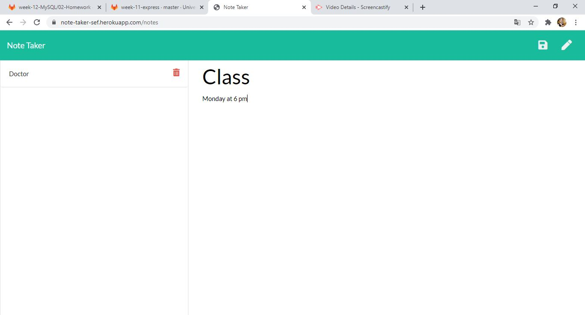

# Note_Taker_SEF 

-----------------------------------------------------------------------------------------------------------------------
Table of content :

* [Purpose](#Purpose)
* [Method](#Method)
* [Node.js](#Nodejs)
* [Express.js](#Expressjs)
* [Demonstration](#Demonstration)
* [URLs](#URLs) 

-----------------------------------------------------------------------------------------------------------------------

## Purpose

The main purpose of this project is to  create a Note Taker application that can be used to write and save notes. This application will use an Express.js back end and will save and retrieve note data from a JSON file.  

-----------------------------------------------------------------------------------------------------------------------

## Method

This application is created using the following languages, libraries and software.

    * Node.js
    * Javascript 
    * VS Code
    * Github
   
-----------------------------------------------------------------------------------------------------------------------

## Nodejs
    
This open-source back-end JavaScript runtime environment is used to invoke the server using the following commands :

    * npm init -y : to intialise node
    * nmp i express: to install the express package
    * nmp i inquirer : to install the inquirer package
    * nmp i path : to install the path package
    * nmp i shortid : to install the shortid package
    * node server.js : to invoke the application 

-----------------------------------------------------------------------------------------------------------------------

## Expressjs
    
Express.js framework is the most widely used Node.js server framework. It allow us to quickly and easily establish our API routes and associated HTTP request methods.

    * Setting up the Express App :  using express() and defining the port
    * Setting up the Express app to handle data parsing : using app.use(express.urlencoded({ extended: true })) and app.use(express.json()) 
    * Setting up routes : app.get()
    * Using post method : app.post()
    * Using delete method  : app.delete()
    * listening to the server : app.listen()

-----------------------------------------------------------------------------------------------------------------------

## Demonstration

* Screenshots for the application:

* Demo: 

-----------------------------------------------------------------------------------------------------------------------

## URLs

* The URL of the deployed application with Heroku : https://note-taker-sef.herokuapp.com/
* The URL of the GitHub repository: https://github.com/SaadiaELF/Note_Taker_SEF.git

-----------------------------------------------------------------------------------------------------------------------
